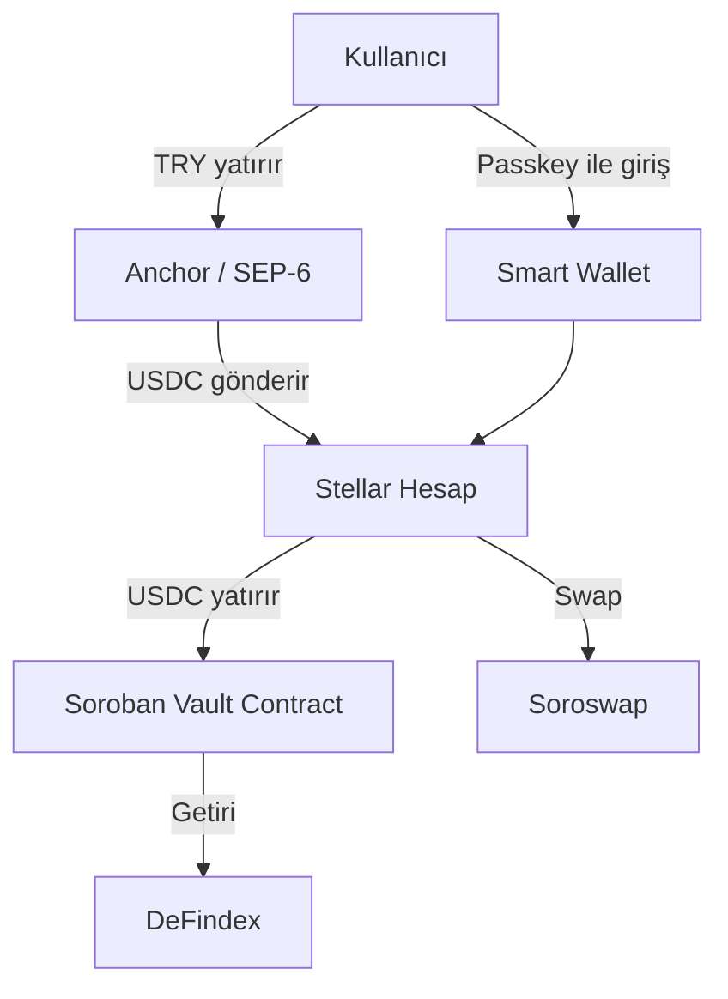

# Submission Hazırlığı

Kodun hazır, ama teslim etmen gereken sadece kod değil. Jüri 6 boyutta değerlendiriyor - her birini kapsadığından emin ol.

## Teslim Gereksinimleri

### Her İki Track (Genesis & Scale)

- [ ] **Public GitHub repo** + README (ne yapar, nasıl çalıştırılır, kim yaptı)
- [ ] **Soroban SDK** kullanıldı, contract'lar **testnet**'e deploy edildi
- [ ] **Demo:** Canlı link veya ≤5 dk video
- [ ] **Kullanılan skill dosyaları** path'iyle belirtildi (örneğin `skills/standards/SKILL.md`)
- [ ] Geliştirmede `stellar-build`, Raven MCP veya skills.stellar.org kullanıldıysa not düşüldü

### Scale Track Ek Gereksinimler

- [ ] SCF RFP formatında teknik write-up
- [ ] Mermaid diyagramı (mimari)
- [ ] Post-hackathon roadmap (SCF/InstAward başvurusu planı)

## Değerlendirme Kriterleri (6 Boyut)

### 1. Anlamlı Fikir & Etki

- Problem açıkça tanımlanmış mı?
- Ölçek ve etki büyüklüğü
- Pazar uygulanabilirliği

### 2. Teknik Uygulama

- Testnet'te deploy edilmiş, özellikler çalışıyor
- Frontend stabil
- Storage tipleri doğru kullanılmış
- Auth uygun şekilde uygulanmış
- Passkey kullanımı bonus

### 3. Ekosistem Uyumu (en ağır boyut)

- **Integration depth:** Seçilen protokol gerçekten kullanılıyor mu?
- **Anchor / Local Payments:** Çalışan bir fiat rayı - **diğer gereksinimlerden ağır basar**
- **Core Feature:** Entegrasyon ürünün iş yaptığının bir parçası mı?
- **Traction:** Gerçek (takım dışı) kullanıcılar var mı?
- Stellar Dev Tools, SDK, CLI ve skills.stellar.org kaynakları kullanılmış mı?

### 4. Kullanıcı Deneyimi

- Kolay ve sezgisel arayüz
- İşlevsellik açıkça uygulanmış
- İyi organize, anlaşılır

### 5. Traction & Süreklilik

- Etkinlik sırasında gerçek kullanım veya kullanıcı edinme
- İnandırıcı post-hackathon roadmap
- Takım bu işi sürdürebilir mi?

### 6. Sunum & Dokümantasyon

- Demo veya README'de açıkça anlatılmış
- Bileşenler ve akış inceleyici için takip edilebilir
- Docs niyet, mimari ve test yöntemini aktarıyor

## README Şablonu

```markdown
# Proje Adı

Tek cümlede ne yaptığını açıkla.

## Problem

Hangi problemi çözüyor, kimin için?

## Çözüm

Nasıl çözüyor? Hangi Stellar primitiflerini kullanıyor?

## Demo

- Canlı: https://...
- Video: https://...

## Mimari

(Mermaid diyagramı veya açıklama)

## Kurulum

\`\`\`bash
git clone ...
cd ...
npm install
npm run dev
\`\`\`

## Teknolojiler

- Stellar SDK + Soroban
- Mock Anchor (SEP-1/6/10/12/38)
- [Diğer entegrasyon partneri]
- Next.js / React / ...

## Kullanılan Stellar Kaynakları

- skills/anchors/SKILL.md
- skills/standards/SKILL.md
- Raven MCP
- stellar-build

## Takım

- İsim 1  - Rol
- İsim 2  - Rol

## Roadmap (Scale Track)

- [ ] Hackathon sonrası: ...
- [ ] SCF/InstAward başvurusu
- [ ] Post-hackathon hedefler
```

## Mermaid Diyagramı Örneği (Scale Track)



## Sunum İpuçları

1. **5 dakikan var** - ilk 2 dakikada problem + çözüm, son 3 dakikada demo
2. Resmi sunum şablonunun **kopyasını** kullan
3. Demo'da **canlı** göster (mümkünse)
4. "Neden blockchain?" sorusuna hazır ol
5. Anchor entegrasyonunu **mutlaka göster** - en ağır kriter

## Son Kontrol

- [ ] README eksiksiz
- [ ] Demo canlı veya video hazır
- [ ] Contract testnet'te deploy
- [ ] Anchor entegrasyonu çalışıyor (deposit/withdraw)
- [ ] Skill dosyaları listelendi
- [ ] Sunum şablonu kopyalandı ve dolduruldu
- [ ] (Scale) Mermaid diyagramı + roadmap hazır
